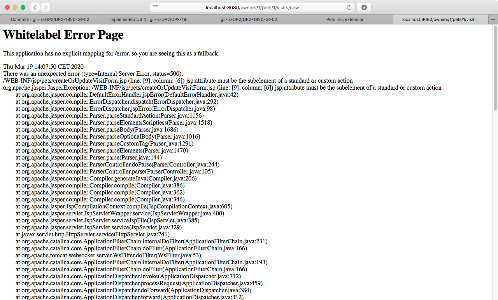
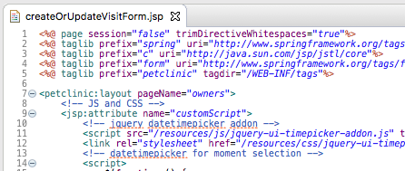
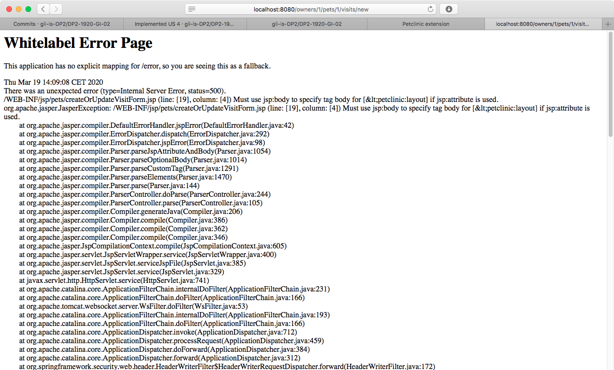
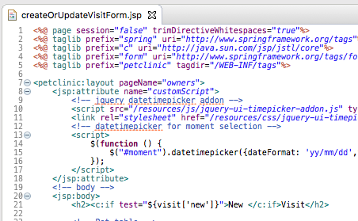

# Soluciones a errores en DP2

## jsp:attribute must be the subelement of a standard or custom action

**Problema:**

Al abrir una vista, sale algunas veces el siguiente error de jsp:

**Causa**:

Antes de `<jsp:attribute>` hay un comentario o una línea en blanco.

**Solución**:

Quitar el comentario o la línea en blanco.

## Must use tsp:body to specify body for ... if jsp:attribute is used

**Problema:**

Al abrir una vista, sale algunas veces el siguiente error de jsp:

**Causa**:

Antes de `<jsp:body>` hay un comentario o una línea en blanco.

**Solución**:

Quitar el comentario o la línea en blanco.